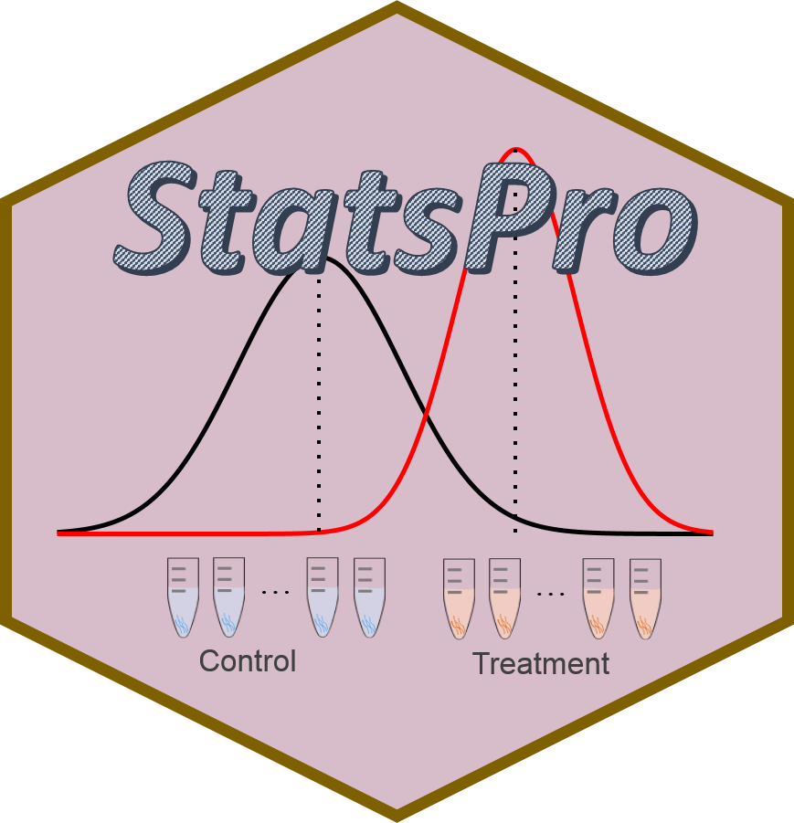
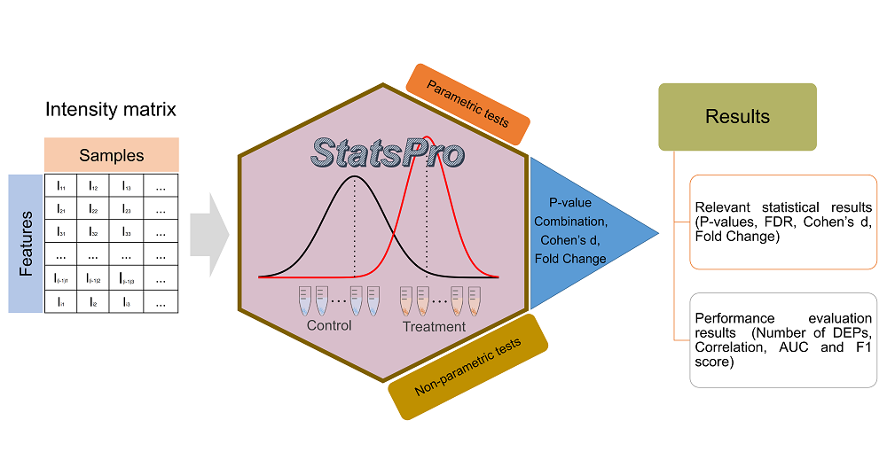
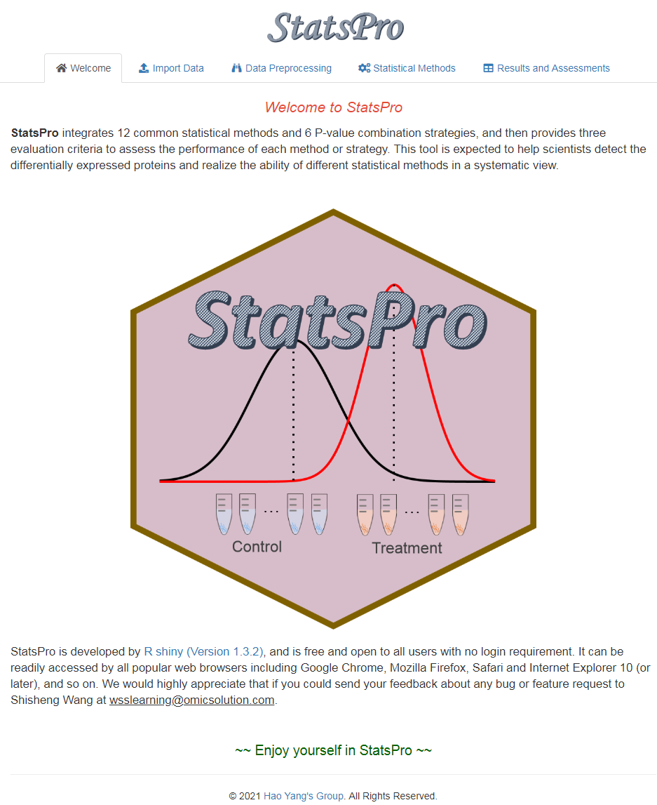

# StatsPro
StatsPro: systematic integration and evaluation of statistical approaches for detecting differential expression in label-free quantitative proteomics

## Brief Description
**<font size='5'> StatsPro </font>** is a web-based tool, which integrates 12 common statistical methods and 6 P-value combination strategies, and then provides three evaluation criteria to assess the performance of each method or strategy (described in Software Manual). This tool is expected to help scientists detect the differentially expressed proteins and realize the ability of different statistical methods in a systematic view. Here we present the detailed introduction and operation of StatsPro, by which users can follow to analyze their own data freely and conveniently. The online version can be accessed from here: [https://www.omicsolution.com/wukong/StatsPro/](https://www.omicsolution.com/wukong/StatsPro/).

## Table of contents graphic



## Software Manual
A detailed introduction of this software can be found in [StatsPro_Manual.pdf](https://github.com/YanglabWCH/StatsPro/blob/master/StatsPro_Manual.pdf) file.

## Preparation for local installation
This tool is developed with R, so if you want to run it locally, you may do some preparatory work:  
**1. Install R.** You can download R from here: [https://www.r-project.org/](https://www.r-project.org/).  
**2. Install RStudio.** (Recommendatory but not necessary). You can download RStudio from here: [https://www.rstudio.com/](https://www.rstudio.com/).  
**3. Check packages.** After installing R and RStudio, you should check whether you have installed these packages (shiny, shinyjs, shinyBS, shinyWidgets, gdata, ggplot2, ggsci, DT, tidyverse, ggExtra, cowplot, readxl, writexl, data.table, Amelia, impute, coin, exactRankTests, limma, samr, RankProd, ROTS, msqrobsum, MSnbase, DEqMS, plgem, effsize, patchwork, survcomp, metaseqR). You may run the codes below to check them:  

```r
if(!require(pacman)) install.packages("pacman")
pacman::p_load(shiny, shinyjs, shinyBS, shinyWidgets, gdata, ggplot2, ggsci, DT, tidyverse, ggExtra, cowplot, readxl, writexl, data.table, Amelia, impute, coin, exactRankTests, limma, samr, RankProd, ROTS, msqrobsum, MSnbase, DEqMS, plgem, effsize, patchwork, survcomp, metaseqR)
```

## Run it locally
If the preparatory work has been done, you can run this tool locally as below:
```r
if(!require(StatsPro)) devtools::install_github("YanglabWCH/StatsPro")
library(StatsPro)
StatsPro_app()
```

Then NAguideR will be started as below:




Enjoy yourself^_^


## Friendly suggestion
1. Open StatsPro with Chrome or Firefox.
2. The minimum operating system specifications are: **RAM 4GB, Hard drive 100 GB.**


## Contact
You could push an issue on this github. And optionally, please feel free to sent me an e-mail if you have any question or find a bug about this tool. Thank you^_^
Email: wsslearning@omicsolution.com.
